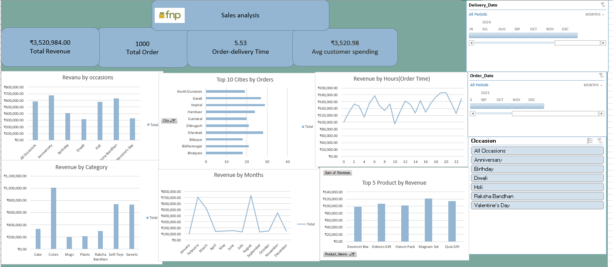

# Sales Analysis Dashboard

# Project Overview

This project presents an interactive Sales Analysis Dashboard developed using Microsoft Excel. The dashboard analyzes sales performance, customer behavior, product performance, and delivery efficiency using Pivot Tables, Pivot Charts, Slicers, and data visualization techniques.

The dashboard helps businesses understand sales trends, identify high-performing products, monitor customer spending, and support data-driven decision-making.

---

# Tools and Technologies

- Microsoft Excel
- Pivot Tables
- Pivot Charts
- Slicers
- Data Cleaning
- Data Visualization

---

# Dashboard Preview



---

# Key Performance Indicators (KPIs)

| Metric | Value |
|--------|--------|
| Total Revenue | ₹3,520,984 |
| Total Orders | 1,000 |
| Average Customer Spending | ₹3,520.98 |
| Average Delivery Time | 5.53 Days |

---

# Dashboard Features

- Revenue analysis by occasions
- Revenue analysis by product categories
- Monthly revenue trends
- Top cities by order volume
- Revenue analysis by order time
- Top-performing products by revenue
- Interactive filters using slicers

---

#  Key Insights

- Anniversary and Raksha Bandhan generated the highest revenue.
- The Colors category contributed the highest sales.
- Evening hours showed higher customer purchasing activity.
- February and August recorded peak sales periods.
- Several cities contributed significantly to overall order volume.
- Average delivery time was 5.53 days.

---

# Project Structure

```
Sales-Analysis-Dashboard/
│
├── data/
│   └── sales_data.xlsx
│
├── dashboard/
│   └── sales_dashboard.xlsx
│
├── screenshots/
│   └── dashboard_overview.png
│
└── README.md
```

---

# Project Objectives

- Analyze sales performance.
- Identify high-performing products.
- Understand customer purchasing behavior.
- Monitor delivery efficiency.
- Support business decisions using data.

---

# Future Improvements

- Develop the dashboard in Power BI.
- Add advanced KPI analysis.
- Build sales forecasting models using Python.
- Perform predictive analytics using machine learning.

---

#  Author

 Prativa pudashani
BSc IT Student  
Aspiring Data Analyst  
Python and Data Science Learner

---

⭐ If you found this project useful, please consider giving it a star.
